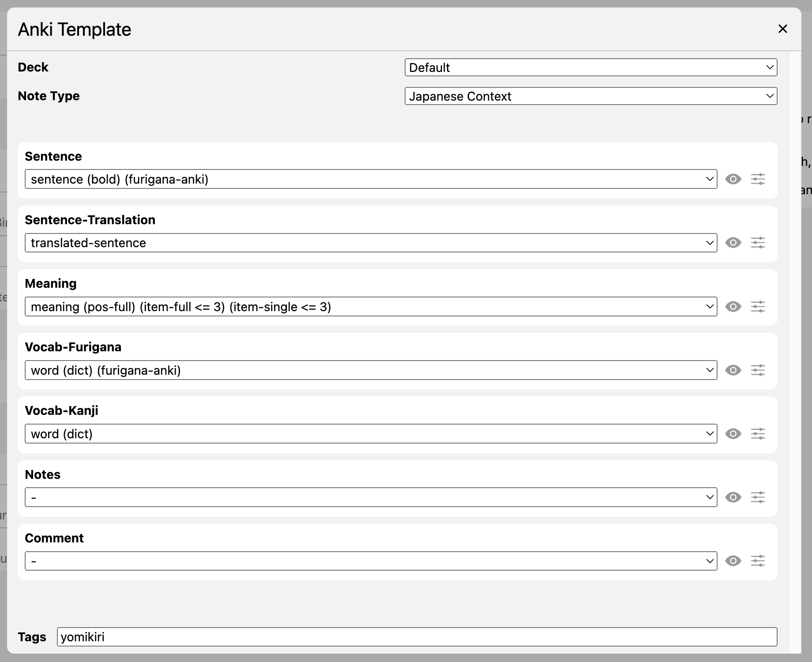

## About

These are Anki note types designed to work well with Yomikiri. 
The note type can be used on desktop, iPad, iPhone. 
Night mode is supported.

Click the below link to download the Anki note types, and open the file in Anki or AnkiMobile app.

<a href="./extra/resources/anki/Yomikiri Japanese Note Types.apkg">Yomikiri Japanese Notetypes.apkg</a>

## Japanese Word

  
  
  

This note type shows you a Japanese word on the front side. Your aim is to recall its meaning and reading. Sentence is also shown on the back side.

### Yomikiri Configuration

  

Above is the recommended Yomikiri configuration for this note type.

You can configure Anki Template in Yomikiri Settings. Click the 'options' button left of the field dropbox, and configure the field options so the template becomes identical to above screenshot.

## Japanese Context

  
  
  

This note type shows you the word used in context of a real sentence on the front.

Instead of adding the full meaning of the word, it is recommended to choose the relevant meaning in Yomikiri when adding note to Anki.

### Yomikiri Configuration

  

Above is the recommended Yomikiri configuration for this note type.

You can configure Anki Template in Yomikiri Settings. Click the 'options' button left of the field dropbox, and configure the field options so the template becomes identical to above screenshot.